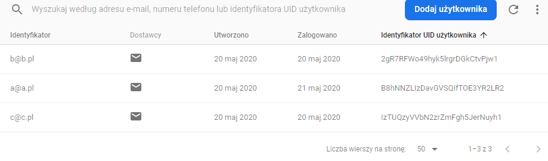

#TRAVELEO

>Android app for travelers and tourists!

## Table of contents
* [General info](#general-info)
* [Screenshots](#screenshots)
* [Technologies](#technologies)
* [Setup](#setup)
* [Features](#features)
* [Status](#status)
* [Contact](#contact)

## General info
Traveleo is an student project developed in Android Studio for Android devices. It's great app for all travelers and also tourists.
This app can help you manage your rent time (Builid-in TIMER), search for attractions (Builid-in BROWSER), call for help (Builid-in CALL 
EMERGENCY BUTTON) and also look where you are and save locations (Builid-in MAP).

This app uses Google's Firebase for managing users, cloud database and its access.

## Screenshots

## Technologies
* Android studio 3.6.3
* Android SDK 24
* Firebase Firestore 21.4.3
* Firebase Auth 19.3.1
* Google Services 4.3.3

## Setup
To setup a project, you need to clone the repo or download its content and open up the main folder in Android Studio, version 3.6.3 or newer.

## Features
List of ready features:
* Signing in
* Signing up
* Singing out
* Search the web browser
* Use timer
* Do notes, that are saving in Google's Firebase
* Make an emergency call
* Invite a friend (Not working yet)
* Send email to support (Not working yet)

## Status
Project has its main functionalities, but it's still in progress.

## Contact
Created by [@ArekadiuszBy](https://github.com/ArekadiuszBy)
